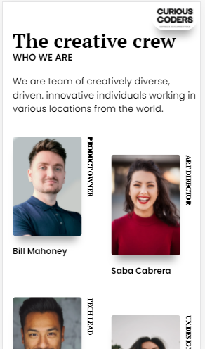
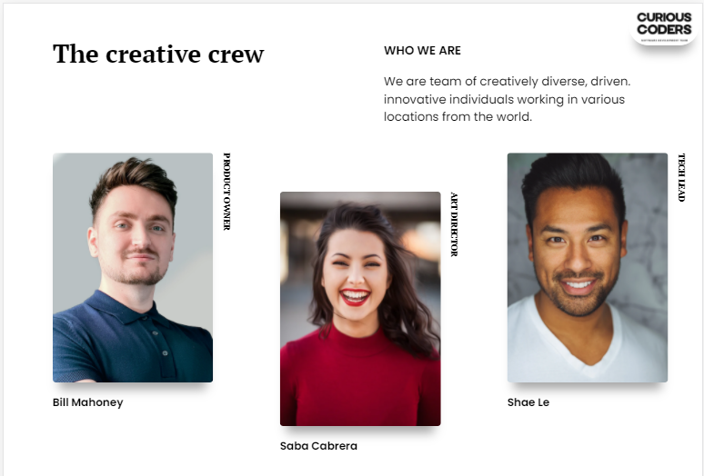

<!-- Please update value in the {}  -->

# Link To My Project [The Creative Team](https://nurkocar.github.io/My-Team-Page/)

## Here is the view of my project...

---------------------------
<h1 align="center">Project Details</h1>

<!-- 

  <h3> 
    <a href="https://nurkocar.github.io/My-Team-Page/">
      My_Project_Link
    </a>
 
  </h3>

 -->

<!-- TABLE OF CONTENTS -->

## Table of Contents

- [Overview](#overview)
- [Built With](#built-with)
- [Features](#features)
- [How to use](#how-to-use)
- [Contact](#contact)

<!-- OVERVIEW -->

## Overview

This is the mobile view of my page

This is the Complete view of my page

 

### Built With

<!-- This section should list any major frameworks that you built your project using. Here are a few examples.-->

- HTML
- CSS

## Features

This application/site was created as a submission to a [Clarusway](https://clarusway.com) Project. 

## How To Use

<!-- This is an example, please update according to your application -->

To clone and run this application, you'll need [Git](https://git-scm.com).From your command line:

# Clone this repository
$ git clone https://github.com/nurkocar/My-Team-Page.git

## Contact

- GitHub [@nurkocar](https://github.com/nurkocar)

- Linkedin [@nurkocar](https://www.linkedin.com/in/nur-kocar/)

